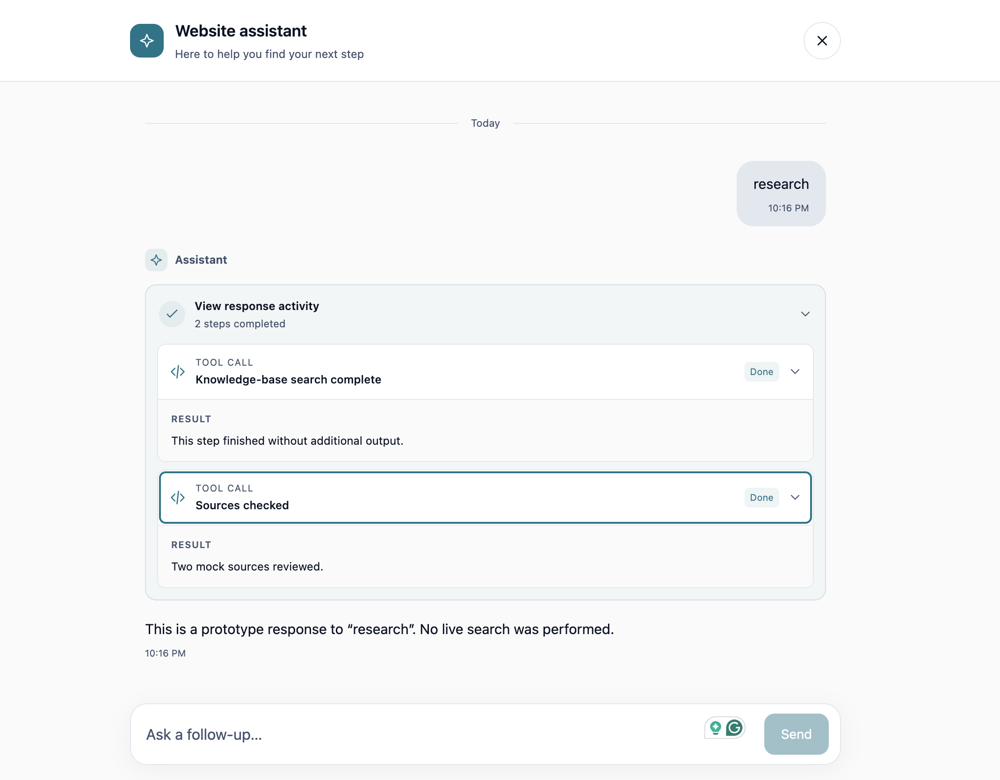
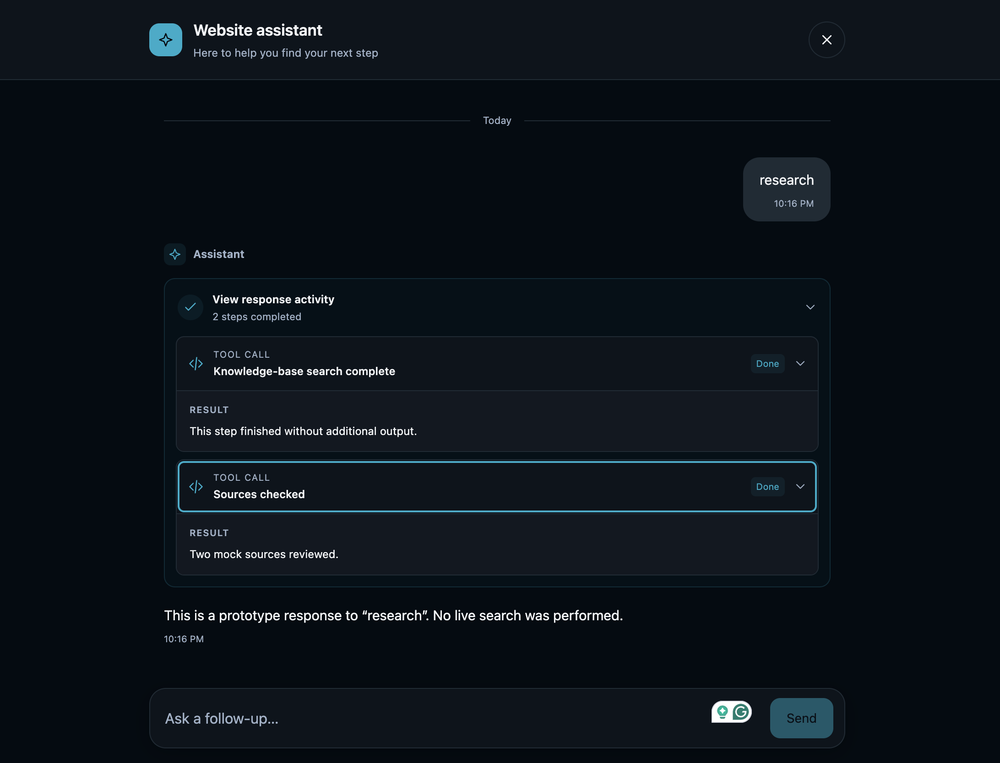

# ZAQ Web Widget

Add a floating chat widget to your website. Visitors can send messages, follow streamed responses and tool activity, and continue chatting without leaving the page.

The widget provides light and dark themes, English, French, and Arabic UI, and a responsive layout. It is built with Phoenix LiveView, React, and assistant-ui. ZAQ supplies the assistant, message routing, and conversation storage; the widget handles presentation and embedding.

## Preview

| Light theme | Dark theme |
| --- | --- |
|  |  |

The screenshots show the local demo with mock responses.

## Add the widget to your website

### 1. Get your widget URL

Ask your ZAQ administrator for:

- Your widget URL, such as `https://YOUR-ZAQ-HOST/widget/YOUR-WIDGET-ID`.
- The embed script URL, such as `https://YOUR-ZAQ-HOST/web_widget/assets/embed.js`.

The administrator must add your website's exact origin to the widget's `allowed_domains`, for example `https://yourwebsite.com`. Development and staging origins need separate entries. Include the scheme and any non-default port; do not include a page path.

If you are deploying the widget inside ZAQ or another Phoenix application, start with the [host integration guide](docs/host-integration.md) and [adapter contract](docs/adapter-contract.md).

### 2. Embed and initialize

Add this once to your website's shared layout. Replace the URLs and supply the current visitor's ID:

```html
<iframe
  src="https://YOUR-ZAQ-HOST/widget/YOUR-WIDGET-ID"
  id="zaq-widget"
  title="ZAQ widget"
></iframe>

<script src="https://YOUR-ZAQ-HOST/web_widget/assets/embed.js"></script>
<script>
  zaq.widget.init({
    user_id: "YOUR-VISITOR-ID",
    settings: { theme: "auto", language: "en" },
  }).catch(error => console.error("Could not initialize chat", error));
</script>
```

The chat stays hidden until a valid `user_id` is accepted. The embed script handles readiness, message validation, default iframe styling, expansion, and page scrolling. You do not need your own `postMessage` or resize listener.

Load the script on the **parent website**, after the iframe and before calling `zaq.widget`. Do not add `async` or `defer` to the script in this example. Code inside the cross-origin iframe cannot expose this API to the parent website.

For a frontend framework, load the script and initialize after the iframe mounts. Keep the widget mounted during client-side navigation. Before removing it, call `zaq.widget.dispose()` to remove listeners and restore the original inline styles and page scrolling. Disposal does not remove the iframe or reset its identity.

### 3. Choose a visitor ID

For signed-in visitors, supply the user ID accepted by your ZAQ integration. For anonymous visitors, generate a random ID and keep it in browser storage:

```js
function getVisitorId() {
  const key = "my-site.zaq.visitor-id";
  let id;
  try { id = localStorage.getItem(key); } catch {}
  if (id?.trim()) return id;

  id = `anonymous-${crypto.randomUUID()}`;
  try { localStorage.setItem(key, id); } catch {}
  return id;
}

// Use this instead of the initialization call above.
zaq.widget.init({ user_id: getVisitorId() }).catch(console.error);
```

Generate the ID once for initialization, not for each message or opening of chat. Storage lets the same browser reuse it across visits. If storage is unavailable, this example's ID lasts for the current widget instance. Clearing storage or using another browser produces a new ID. Random browser IDs are not authentication; ZAQ remains responsible for validating access.

See [the website integration guide](widget-guideline.md) for a complete anonymous-visitor setup.

## Language and theme

The website owns these settings. Pass them during initialization or update them while the visitor is chatting:

```js
await zaq.widget.updateSettings({ theme: "dark" });
await zaq.widget.updateSettings({ language: "fr" });
await zaq.widget.updateSettings({ theme: "light", language: "ar" });

// Optional inspection; not required before an update.
const settings = await zaq.widget.getSettings();
```

| Setting | Accepted values | Default |
| --- | --- | --- |
| `theme` | `"auto"`, `"light"`, `"dark"` | `"auto"` |
| `language` | `"en"`, `"fr"`, `"ar"` | `"en"` |

`auto` follows browser appearance. Arabic uses a right-to-left layout. Language changes translate widget controls, accessibility labels, and widget-generated errors; they do not translate ZAQ's messages or choose the assistant's response language.

Updates merge the supplied fields and preserve messages, drafts, pending responses, and the selected conversation. Unsupported values or unknown keys reject the whole update. Methods return promises: handle failures with `catch` or `try/catch`. Requests time out after 20 seconds; after an update timeout, inspect settings before retrying because the update may already have reached the iframe.

Settings survive LiveView reconnects. If the iframe document reloads while the parent client remains alive, the client reapplies its accepted context and latest settings. Your website decides whether to save preferences across parent-page reloads. Language and theme do not belong in ZAQ's persisted widget configuration.

## Initialization and conversations

```js
await zaq.widget.init({
  user_id: "visitor-123",
  prompt_context: "Current page: /menu",
  conversation_id: null,
  settings: { language: "en", theme: "auto" },
});
```

| Field | Purpose |
| --- | --- |
| `user_id` | Required, nonblank visitor ID validated by ZAQ. |
| `prompt_context` | Optional string with context for the host; defaults to `null`. |
| `conversation_id` | Optional real conversation ID to resume; defaults to `null`. |
| `settings` | Optional language and theme preferences. |

A visitor ID and a conversation ID are different. Do not invent a conversation ID or substitute the visitor ID. Conversation history and authorization depend on the ZAQ integration; keeping the visitor ID alone does not guarantee that a specific conversation reopens.

Closing chat collapses the widget without ending the conversation. Changing identity or bootstrap context requires a fresh iframe document. Use `updateSettings()` for later presentation changes; repeated `init()` calls do not overwrite runtime settings.

The global `zaq.widget` API currently targets **one iframe with `id="zaq-widget"`**. For multiple widgets or custom layout ownership, import `createWidgetClient` from `/web_widget/assets/widget-client.js` and create a client for each iframe. That lower-level API leaves placement and resizing to your website; do not give multiple frames the same HTML ID.

## Customize the appearance

Theme is selected through `init()` or `updateSettings()`. To change branding, ask the ZAQ administrator to configure a `stylesheet_url` loaded inside the widget. For example:

```css
:root {
  --zaq-widget-primary: #7356c7;
  --zaq-widget-on-primary: #fff;
  --zaq-widget-radius: 12px;
  --zaq-widget-font-family: system-ui, sans-serif;
}
```

Use unlayered CSS to override the built-in defaults. More tokens are defined in [widget.css](assets/css/widget.css), including background, text, borders, and composer colors. Color tokens can use `light-dark(lightColor, darkColor)` to follow the selected theme. A failed stylesheet leaves the built-in theme available.

Website CSS cannot cross the iframe boundary. The embed script manages the outer iframe's default placement and height; the widget stylesheet controls its inner appearance. Keep the outer iframe's `color-scheme: light dark` default to preserve transparency.

## Run the demo locally

Prerequisites:

- Elixir and Erlang/OTP. CI currently uses Elixir 1.19.5 and OTP 28.1.
- Node.js 22.12+ in the 22 series, or Node.js 24, with npm.
- PostgreSQL. Development defaults are configured in [config/dev.exs](config/dev.exs).

```sh
mix setup
mix phx.server
```

Open `http://localhost:4000/widget-demo`. The demo uses the same `embed.js` and `zaq.widget.init()` API as the website integration. You can select startup settings with `/widget-demo?theme=dark&language=ar`, or run `zaq.widget.updateSettings(...)` from the parent-page browser console.

| Message | Demo response |
| --- | --- |
| `hello` | Streamed greeting. |
| `search` | One tool call, result, and streamed answer. |
| `research` | Two tool calls with independent progress. |
| `fail` | Tool and message failure, followed by the ability to send again. |
| `slow` | Slower tool and streaming events. |

The demo uses a mock host, not a live ZAQ agent. Enable its conversation sidebar with `WEB_WIDGET_DEMO_MULTIPLE_CONVERSATIONS=true mix phx.server`. To embed the local demo on another origin, set `WEB_WIDGET_DEMO_ALLOWED_DOMAINS` to a comma-separated list of exact allowed origins and restart the server.

Iframe and embed assets use the built bundle. Run `mix assets.build` after changing them; the Vite development watcher alone does not rebuild those assets.

## Contributing

Contributions to behavior, accessibility, translations, documentation, and tests are welcome.

1. Fork or clone the repository and create a branch for your change.
2. Follow the local setup above and read [AGENTS.md](AGENTS.md), the [Elixir guidelines](docs/elixir-guidlines.md), and the [adapter contract](docs/adapter-contract.md) where relevant.
3. Make a focused change and add tests for the behavior it affects. Update documentation when changing the public API.
4. Run the checks below and open a pull request describing the problem, the change, and how you tested it. Include screenshots for visual changes.

### Project layout

| Path | Responsibility |
| --- | --- |
| `lib/web_widget/` | Host runtime, adapter, routing helpers, and event contracts. |
| `lib/web_widget_web/` | LiveView state, rendering, and standalone demo. |
| `assets/react-components/` | React and assistant-ui presentation. |
| `assets/js/` | Parent embed client and iframe messaging. |
| `assets/css/` | Widget and demo styles. |
| `priv/gettext/` | UI translation catalogs for English, French, and Arabic. |
| `test/` | Elixir tests. |
| `assets/tests/` | Playwright browser tests and mock host fixtures. |

Keep canonical conversation state in LiveView and preserve the plain-map host boundary. Browser updates use the existing LiveView WebSocket. ZAQ owns routing, permissions, identity resolution, and durable state; host response events use the `response.*` namespace.

### Checks

```sh
mix assets.build
mix precommit
```

The asset build checks TypeScript and produces widget, client, and embed bundles. `mix precommit` checks formatting, runs strict Credo, compiles with warnings as errors, and runs the Elixir tests.

For browser changes, install Playwright's browsers once and run the relevant tests:

```sh
cd assets
npx playwright install chromium firefox webkit
npm run test:e2e
```

From the repository root, run a single browser or test file with:

```sh
npm --prefix assets run test:e2e -- --project=firefox
npm --prefix assets run test:e2e -- themes.spec.ts
```

The suite runs against real iframe, React, and LiveView code with mock host responses. Its servers use ports 4019, 4020, and 4021; run one suite at a time. CI runs Chromium, Firefox, and WebKit separately. Real-device mobile keyboard behavior still needs manual validation.

For Elixir coverage:

```sh
mix coveralls.json
mix coverup 95 20
```

`coverup` lists changed Elixir files below the target with uncovered line numbers. It requires a fresh coverage report, Git, jq, and a local `main` branch. Use `mix coveralls.html` for a browsable report.

### Translations

Widget UI strings come from [Localization](lib/web_widget_web/localization.ex) through Gettext and are passed to React. When adding a UI string, update the English, French, and Arabic catalogs under `priv/gettext/` and test the affected UI, including Arabic layout. Do not translate host-provided response content in the widget.
